# Hiffi User Journeys

Branching decision trees for every realistic user path on Hiffi (hiffi.com), based on actual routes and components in this codebase.

**Scope notes**

- **Curated Mix** appears in two places: **Home mood orbs** (7 moods → live playlist on Watch) and **sidebar Curated Mix** (up to 3 admin playlists → Watch with `?playlist=`).
- **`/hip-hop/mood/*`** are SEO/marketing pages; they link to **Search**, not a live player.
- **Artist Index** (`/artist-index/*`) hides main app chrome (no navbar/sidebar).
- **Extended surfaces** (§9–17): History, Liked, Following, User Playlists, Creator Apply, Studio, Referral, Guest nudges, Support reports. See §18 for global video context (mini-player **not mounted**).

---

## 1. Home Feed (`/`)

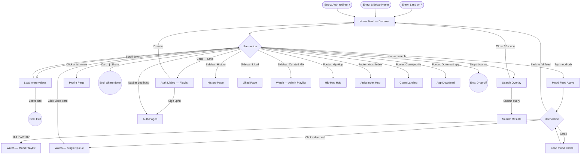

| Node | Trigger/Action | Next Node(s) | Notes |
|------|----------------|--------------|-------|
| Home Feed — Discover | Land `/`, sidebar Home | Scroll, mood, video, search, sidebar | Default feed via `getVideoList`; infinite scroll in `VideoGrid` |
| Mood Feed Active | Tap mood orb (`MoodPickerCard`) | PLAY, video click, back, scroll | 7 moods in `lib/mood-tabs.ts`; cached per mood |
| Watch — Mood Playlist | ActiveMoodBar PLAY | Watch journey | Navigates `/watch/{id}?playlist=mood:{vibe}&pindex=0` |
| Watch — Single/Queue | Click `VideoCard` | Watch journey | In mood feed, passes `playlistNavigation` for queue context |
| Auth Dialog — Playlist | Card ⋮ Add to playlist (guest) | Auth or dismiss | `AuthDialog` copyKey `playlist`; no pending-intent replay |
| Search Overlay | Navbar search icon | Search results or close | Overlay debounced suggestions; Escape returns to Home |
| History / Liked | Sidebar links | Guest conversion or content | Guests see `GuestHistoryView` / `GuestLikedView` with signup CTAs |
| Watch — Admin Playlist | Sidebar Curated Mix click | Watch journey | Max 3 playlists; `/watch/{id}?playlist={id}&pindex=0` |

---

## 2. Search (`/search?q=` + overlay)

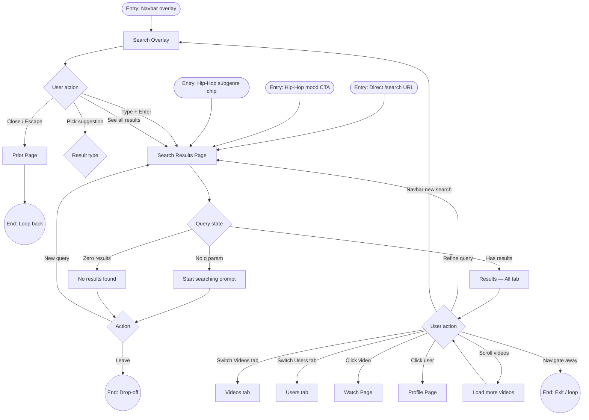

| Node | Trigger/Action | Next Node(s) | Notes |
|------|----------------|--------------|-------|
| Search Overlay | Navbar icon | Submit, suggestion, close | Trending chips, recent (localStorage), live suggestions (400ms debounce) |
| Search Results Page | `?q=` param | Tabs, results, empty | `@username` → user-only search mode |
| Results — All tab | Default with results | Video/user click, tabs | Parallel video + user search |
| No results found | Empty API response | Retry query or exit | Spelling hint shown |
| Watch Page | Click video result | Watch journey | Processing videos may toast block |
| Prior Page | Overlay close | Home or current route | No navigation on abandon — stays on page |

---

## 3. Watch (`/watch/[videoId]`)

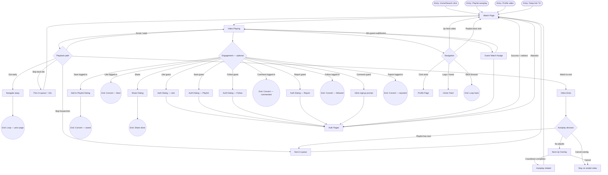

| Node | Trigger/Action | Next Node(s) | Notes |
|------|----------------|--------------|-------|
| Video Playing | Page load | Playback, engage, nav | Public; `autoPlay=true`; guests tracked via `device_id` |
| Video Ends | Natural end | Playlist next or Next-Up | Playlist queue prioritized over related feed |
| Next-Up Overlay | ~10s before end (no playlist) | Autoplay or cancel | 5s countdown; first of 8 related suggestions |
| Auth Dialog — Like | Heart tap (guest) | Auth or dismiss | Optimistic UI; pending intent replayed post-auth |
| Auth Dialog — Follow | Follow btn (guest) | Auth or dismiss | Pending follow intent replayed post-auth |
| Auth Dialog — Playlist | Bookmark (guest) | Auth or dismiss | **No** pending-intent replay for save |
| Inline signup prompt | Comment focus (guest) | `/signup` or `/login` | Read-only textarea until auth |
| Share Dialog | More → Share | Done | No auth; WhatsApp, X, copy link, etc. |
| Next in queue | Skip fwd / playlist end | Watch (in-place) | `history.pushState` preserves fullscreen |
| Profile Page | Artist avatar/name | Profile journey | Links to `/profile/{username}`, not artist-index |

**UX risks:** Dislike handler exists but has **no UI**. Guest report opens auth dialog (report dialog closes first).

---

## 4. Playlist / Curated Mix

Three playlist entry types share Watch playback logic (`lib/playlist-session.ts`).

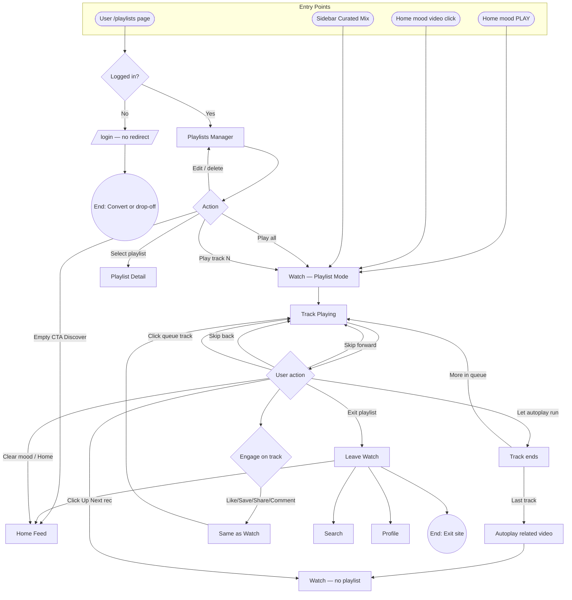

| Node | Trigger/Action | Next Node(s) | Notes |
|------|----------------|--------------|-------|
| Watch — Playlist Mode | Mood PLAY, sidebar mix, user playlist | Track playing | URL: `?playlist={id}&pindex={n}`; session in `sessionStorage` |
| Playlists Manager | `/playlists` (auth) | Detail, play, edit | **Hard redirect** to `/login` without `?redirect=` — UX risk |
| Track Playing | Autoplay default `true` | Skip, engage, exit | Sidebar shows active playlist panel (desktop + mobile) |
| Track ends | Natural completion | Next track or related | User playlists, curated API playlists, mood playlists all supported |
| Click Up Next rec | Sidebar suggestion | Watch without playlist | Breaks out of queue context |
| Home mood feed | Orb selection (no PLAY yet) | Browse mood grid | Not playlist mode until PLAY or video click with queue |

**Not implemented:** `/hip-hop/mood/{slug}` does **not** start a playlist — only links to Search.

---

## 5. Sidebar Navigation

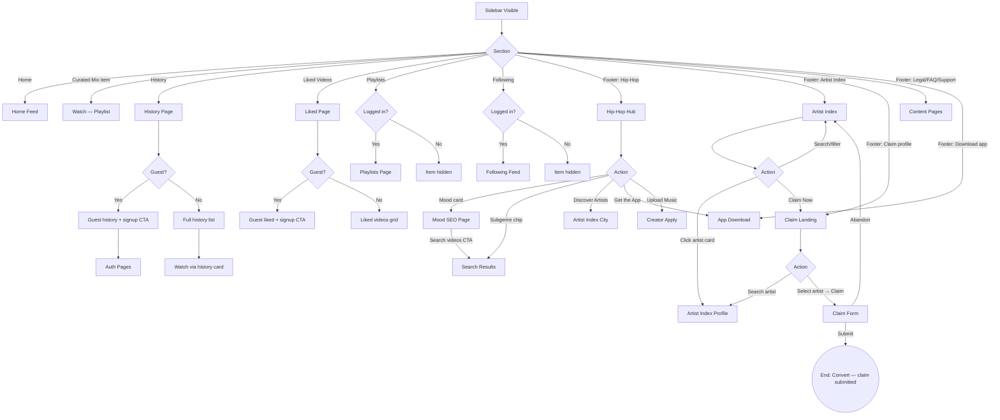

| Node | Trigger/Action | Next Node(s) | Notes |
|------|----------------|--------------|-------|
| Playlists / Following | Sidebar (auth-gated) | Page or hidden | `requireAuth: true` — items **not rendered** for guests |
| Following Feed | Direct URL `/following` (guest) | Signup/login CTAs | Page accessible but sidebar link hidden — partial dead end |
| Hip-Hop Hub | `/hip-hop` | Mood SEO, search, artist index | Marketing hub with JSON-LD |
| Mood SEO Page | `/hip-hop/mood/{slug}` | Search only | **No live player** — dead end for playback intent |
| Artist Index | `/artist-index` | Filter, artist detail, claim | **No app chrome** — isolated layout |
| Claim Landing | `/artist-index/claim` | Search → claim form | **No login required** |
| Content Pages | Legal, FAQ, support links | Read-only | Minimal chrome; `SiteFooter` on marketing pages |

---

## 6. Artist / Profile Page

Two systems: **platform profiles** (`/profile/[username]`) and **artist directory** (`/artist-index/[slug]`).

```mermaid
flowchart TD
    subgraph Platform["Platform Profile /profile/username"]
        EP1([Entry: Watch artist link]) --> PR[Profile Page]
        EP2([Entry: Search user]) --> PR
        EP3([Entry: Navbar menu]) --> PR

        PR --> PV{Viewer context}
        PV -->|Own profile| OWN[Personal / Creator view]
        PV -->|Other creator| PUB[Public creator view]
        PV -->|Non-creator member| MEM[Member view]

        PUB --> A1{Action}
        MEM --> A1
        A1 -->|Click video| WV[Watch Page]
        A1 -->|Follow guest| AD[Auth Dialog]
        A1 -->|Follow logged-in| T_FOL((End: Convert — followed))
        A1 -->|Unfollow| T_UNFOL((End: Convert — unfollowed))
        A1 -->|Share| T_SHARE((End: Share done))
        A1 -->|Report| T_REP((End: Report filed))
        A1 -->|Scroll videos| A1

        OWN --> A2{Action}
        A2 -->|Edit profile| T_EDIT((End: Convert — edited))
        A2 -->|Delete video| A2
        A2 -->|Copy referral| T_REF((End: Convert))
        A2 -->|Collaborate link| COLLAB[/collaborate?artist=]
        A2 -->|Click video| WV

        A1 -->|Exit| HF[Home / Search]
        AD --> AUTH[Auth Pages] --> PR
    end

    subgraph Directory["Artist Index /artist-index/slug"]
        EP4([Entry: Index card]) --> AP[Artist Directory Profile]
        EP5([Entry: City/genre page]) --> AP

        AP --> A3{Action}
        A3 -->|Claim profile| CF[Claim Form — no auth]
        A3 -->|Suggest edit| EDIT[Inline Edit Form]
        A3 -->|View Hiffi profile| PR
        A3 -->|External social| T_EXT((End: Exit — external))
        A3 -->|Related artist| AP
        A3 -->|Exit to index| AI[Artist Index Hub]
        CF --> T_CLAIM((End: Convert — claim submitted))
    end
```

| Node | Trigger/Action | Next Node(s) | Notes |
|------|----------------|--------------|-------|
| Profile Page | `/profile/{username}` | Videos, follow, share | Public; API 401 shows inline sign-in prompt |
| Auth Dialog — Follow | Follow (guest) | Auth → return to profile | Pending follow intent replayed |
| Artist Directory Profile | `/artist-index/{slug}` | Claim, edit, Hiffi profile | Inventory system; separate from watch links |
| Claim Form | `/artist-index/{slug}/claim` | Submit confirmation | Name + email only; `POST /api/inventory/claims` |
| Inline Edit Form | `?edit=1` on artist page | Submit suggestion | No auth required for suggest-edit |
| Watch Page | Click creator video | Watch journey | Infinite scroll on video grid (10/page) |

---

## 7. Sign Up / Log In

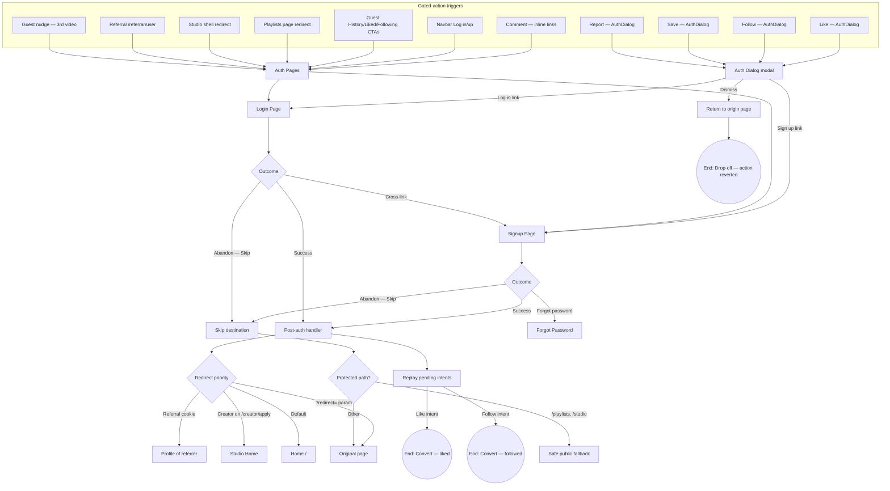

| Node | Trigger/Action | Next Node(s) | Notes |
|------|----------------|--------------|-------|
| Auth Dialog modal | Like, follow, save, report (guest) | Signup/login pages or dismiss | Preserves `pathname+search` in redirect URL |
| Signup Page | `/signup?redirect=` | Success, skip, forgot | Username availability check live; optional `?ref=` referral |
| Login Page | `/login?redirect=` | Success, skip | Username or email + password |
| Post-auth handler | Successful auth | Redirect + intent replay | Clears guest conversion session |
| Replay pending intents | After login/signup | Like and/or follow API calls | **Playlist save not replayed** |
| Skip destination | Skip button on auth pages | Safe fallback or redirect | `/studio` → `/creator/apply`; `/playlists` → `/` |
| Playlists redirect | Guest hits `/playlists` | `/login` only | **Missing `?redirect=`** — UX risk |
| Referral landing | `/referrar/{username}` | Signup with cookie | Logged-in users sent to `/` |
| Dismiss Auth Dialog | Close without auth | Origin page | Like UI reverted; pending intent cleared |

---

## 8. App Download (`/app`)

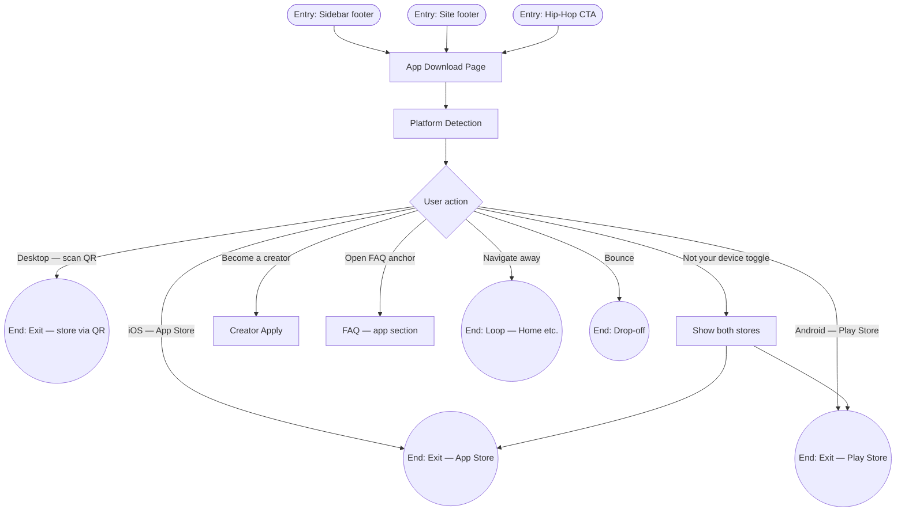

| Node | Trigger/Action | Next Node(s) | Notes |
|------|----------------|--------------|-------|
| App Download Page | `/app` | Store links, FAQ, creator | Uses `hiffi_platform` cookie + UA detection |
| App Store / Play Store | Primary CTA | External store | URLs from env (`HIFFI_APP_STORE_URL`, etc.) |
| Desktop QR codes | Desktop layout | External store | Dual QR for iOS + Android |
| Creator Apply | Secondary CTA | Creator flow | Creators redirected to `/studio` if already approved |
| FAQ anchor | `/faq#app-and-downloads` | Read-only | Minimal chrome content page |

**UX note:** On `/app`, navbar/sidebar use black text styling (`isAppDownloadPage`) — distinct visual mode.

---

## Cross-feature loops

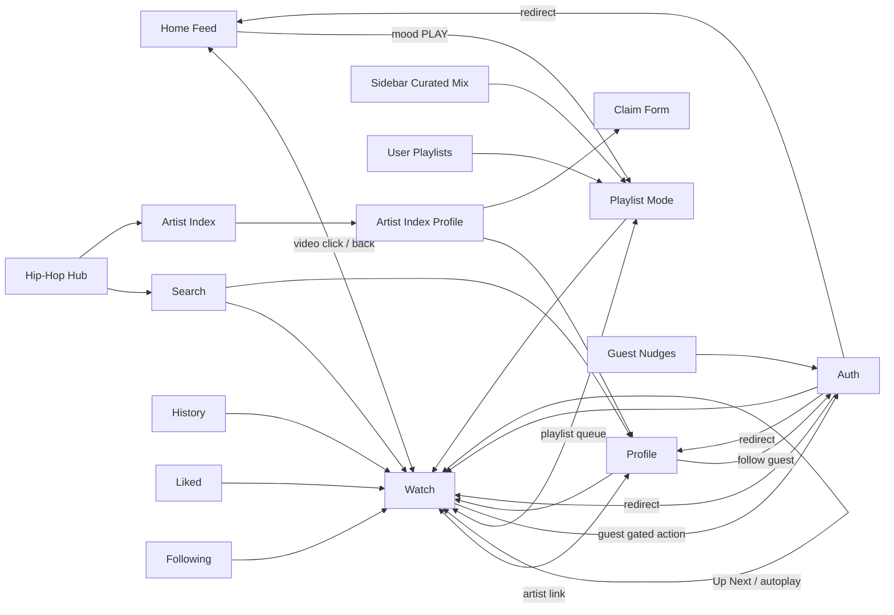

| Hub node | Incoming journeys | Outgoing journeys | Loop type |
|----------|-------------------|-------------------|-----------|
| **Watch** | Home, Search, Profile, History, Liked, Following, Playlists, Sidebar mix, autoplay chain | Profile, next video, Home, Search | Self-loop via Up Next / playlist |
| **Profile** | Watch, Search, Artist Index, navbar | Watch, follow (auth), Search | Watch → Profile → Watch |
| **Search** | Navbar, Hip-Hop mood SEO, Hip-Hop chips | Watch, Profile | Refine-query loop |
| **Home Feed** | Logo, sidebar Home, auth default, skip fallback | Watch, Search overlay, all sidebar/footer | Mood feed sub-loop |
| **Artist Index** | Sidebar, Hip-Hop, footer | Artist profile, Claim, Platform profile; logo → Home | Chrome swap (no sidebar); Index → Profile → Watch |
| **Auth** | Any gated action, guest pages, studio, playlists | Returns to `?redirect=` origin | Resume interrupted action (like/follow only) |
| **Playlist mode** | Home mood, sidebar mix, `/playlists` | Watch queue navigation | Exits to non-playlist Watch via Up Next |

---

## UX risks & gaps (code-verified)

Each row was checked against source — not inferred from product intent.

| Status | Risk | Location | Evidence | Impact |
|--------|------|----------|----------|--------|
| **Confirmed** | Mood SEO pages cannot start playback | `/hip-hop/mood/{slug}` | `app/(main)/hip-hop/mood/[slug]/page.tsx` — primary CTAs are `Link` to `/search?q=…` and `/creator/apply` only; no `/watch` or `activatePlaylistNavigation` | Users arriving from SEO/hip-hop hub expecting a mood mix must search manually; home mood PLAY is the only in-app playlist entry for moods |
| **Confirmed** | Playlists login loses return path | `/playlists` | `app/(main)/playlists/page.tsx` L265, L338, L365 — all use `router.push("/login")` without `buildLoginUrl("/playlists")` | Guest/deep-link bookmark loses context after auth; contrast with `/support/reports` which uses `buildLoginUrl` |
| **Confirmed** | Following is hidden but URL-accessible | Sidebar + `/following` | `components/layout/sidebar.tsx` L174–175 `requireAuth: true`, L193 `return null`; `app/(main)/following/page.tsx` L164–171 renders `FollowingEmptyState` for guests | No sidebar discovery path; direct URL works with signup CTAs — inconsistent with Playlists (hard redirect) |
| **Partially confirmed** | Artist Index swaps app chrome | `/artist-index/*` | `components/layout/app-layout.tsx` L30–31 sets `showAppChrome = false` (no navbar/sidebar/search overlay) | **Correction:** not a dead end — `components/artists/ArtistIndexHeader.tsx` L26 links logo → `/`; `ArtistDirectoryShell` renders `SiteFooter` with Discover links. Risk is **navigation pattern change**, not missing exit |
| **Confirmed** | Save-to-playlist not replayed post-auth | Guest save flow | `lib/guest-conversion/pending-intents.ts` — only `like` and `follow` types; `lib/guest-conversion/replay-intents.ts` L14–20 replays only those two | Guest who saves, signs up, returns must re-open save dialog manually |
| **Confirmed** | Dislike handler has no UI | Watch page | `watch-client.tsx` L1440 defines `handleDislike`; repo-wide grep shows **no** `onDislike` prop or click binding | Dead code path; guests get toast-only message if ever called |
| **Confirmed** | Watch links creators to platform profile only | `/watch/[videoId]` | `watch-client.tsx` L1935, L1953, L1995, L2013 — all `href={/profile/…}` | Artist Index inventory profiles are a separate surface; no cross-link from watch metadata |
| **Confirmed** | Mini-player component never mounted | Global video context | `lib/video-context.tsx` implements `playVideo` + mini mode; `components/video/global-persistent-player.tsx` exists but is **not imported** in `app/layout.tsx` or any page | `VideoCard` calls `playVideo()` on click but user still navigates via `Link` to `/watch`; mini-player UI never renders |

**Not a risk (verified):** Referral landing (`app/referrar/[username]/page.tsx`) omits `?redirect=` but `lib/auth-context.tsx` L538–546 routes post-signup to `/profile/{referrer}` via `getReferralRedirectProfile()` — intentional override.

---

## 9. History (`/history`)

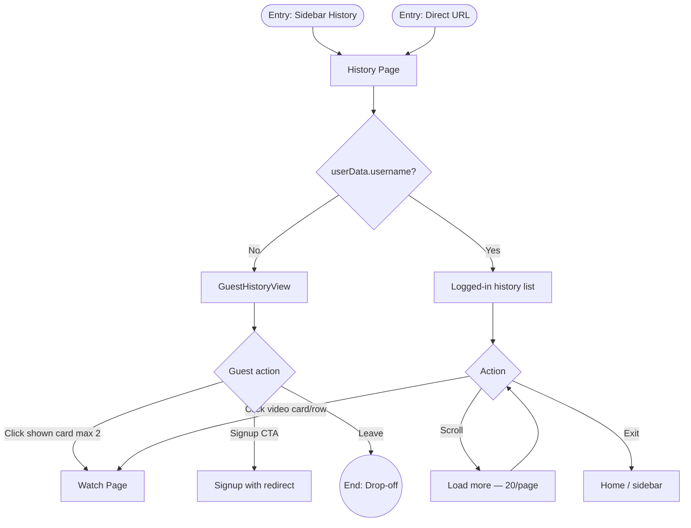

| Node | Trigger/Action | Next Node(s) | Notes |
|------|----------------|--------------|-------|
| GuestHistoryView | `!userData?.username` (`history/page.tsx` L415–416) | Watch, signup | `getGuestHistory()` sessionStorage; shows first 2 entries (`guest-history-view.tsx` L20) |
| Logged-in history | API `getWatchHistory` | Watch, infinite scroll | Grouped by date; list + card layouts |
| Signup CTA | Guest panel button | `/signup?redirect=/history` | Uses `buildSignupUrl` |

---

## 10. Liked Videos (`/liked`)

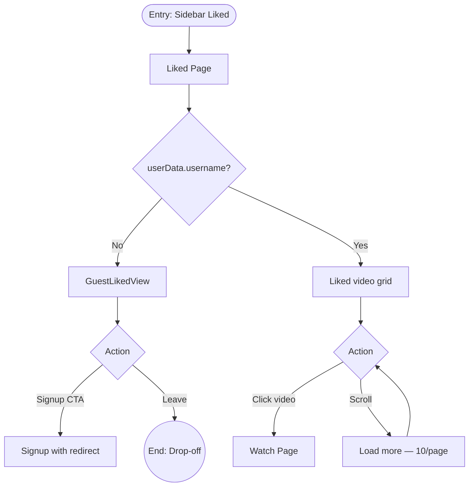

| Node | Trigger/Action | Next Node(s) | Notes |
|------|----------------|--------------|-------|
| GuestLikedView | `liked/page.tsx` L160–161 | Signup only | No local liked preview — empty conversion shell |
| Liked grid | `apiClient` liked videos | Watch | Sidebar link visible to **all** users (no `requireAuth`) |

---

## 11. Following Feed (`/following`)

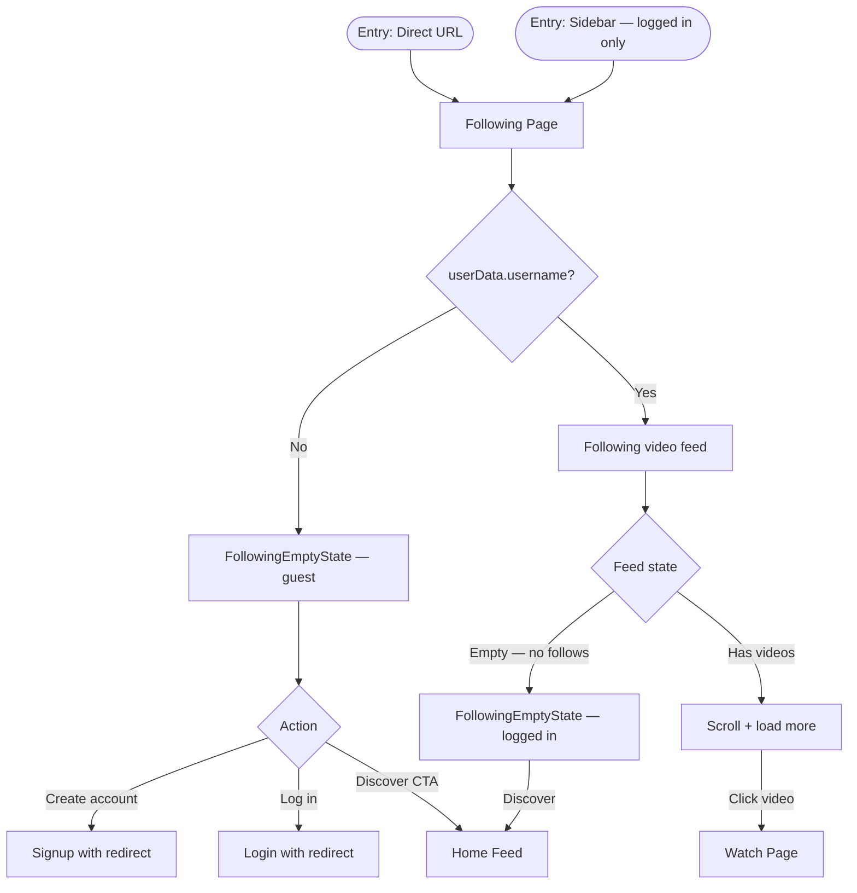

| Node | Trigger/Action | Next Node(s) | Notes |
|------|----------------|--------------|-------|
| Sidebar link | `requireAuth: true` | Hidden when `!user` | Guests must know URL or follow footer/marketing links |
| Guest empty state | `following/page.tsx` L164–171 | Auth or Home | `FollowingEmptyState` with signup + login (`following-empty-state.tsx` L32–50) |
| Logged-in feed | `getFollowingVideos` | Watch | 10 videos per page |

---

## 12. User Playlists (`/playlists`)

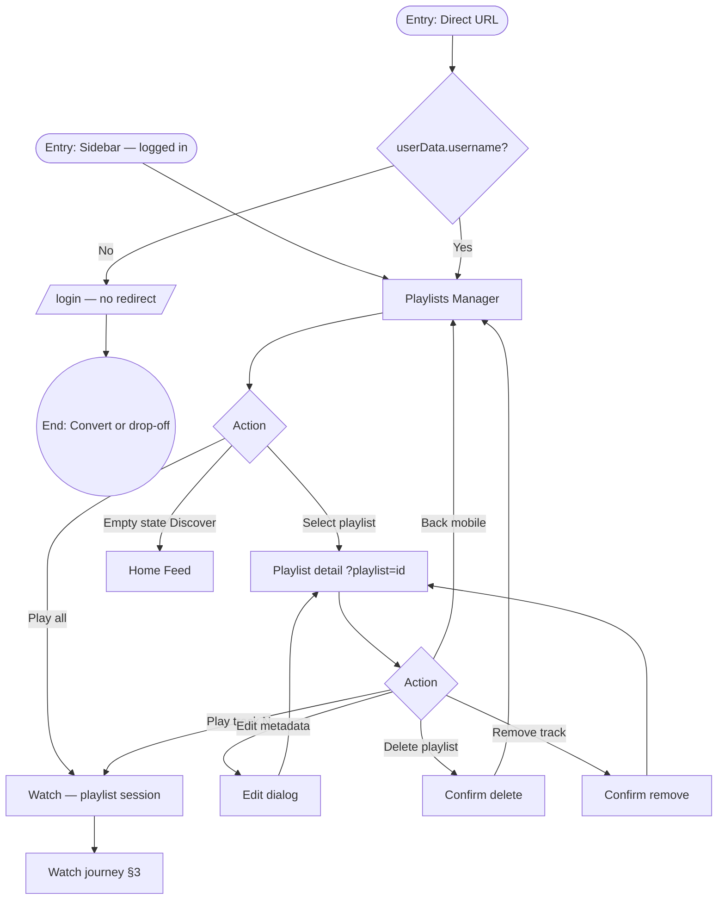

| Node | Trigger/Action | Next Node(s) | Notes |
|------|----------------|--------------|-------|
| Auth gate | `playlists/page.tsx` L362–366 | `/login` bare | Also on API 401 at L265, L338 |
| Play | Sets `sessionStorage` + `?playlist=&pindex=` | Watch autoplay queue | Same session lib as curated mix |
| CRUD | Edit/delete/remove dialogs | In-page | Deleting last track can delete playlist |

---

## 13. Creator Apply (`/creator/apply`)

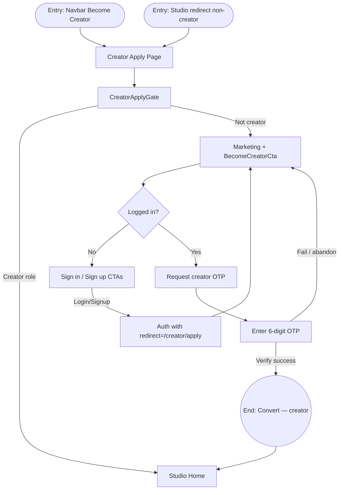

| Node | Trigger/Action | Next Node(s) | Notes |
|------|----------------|--------------|-------|
| CreatorApplyGate | `creator-apply-gate.tsx` L38–41 | Redirect creators to `STUDIO_HOME` | Prevents apply page flash for existing creators |
| Guest CTAs | `become-creator-cta.tsx` L230, L295–304 | Auth pages with redirect | `buildLoginUrl` / `buildSignupUrl` preserve `/creator/apply` |
| OTP upgrade | `requestCreatorUpgrade` + `verifyCreatorUpgrade` | Creator role | Requires account email on profile |

---

## 14. Hiffi Studio (`/studio/*`)

```mermaid
flowchart TD
    EP1([Entry: Navbar Studio]) --> SH[StudioShell]
    EP2([Entry: Post-creator upgrade]) --> SH

    SH --> AUTH{user?}
    AUTH -->|No| LOGIN[/login?redirect=/studio/]
    AUTH -->|Yes| ROLE{creator role?}

    ROLE -->|No| APPLY[/creator/apply]
    ROLE -->|Yes| ST[Studio hub]

    ST --> A1{Tool}
    A1 -->|Upload| UP[/studio/tools/upload]
    A1 -->|Migrate| MG[/studio/tools/migrate]

    UP --> U1{Upload flow}
    U1 -->|Select file + metadata| QUEUE[Upload queue]
    QUEUE --> T_DONE((End: Convert — published))

    MG --> M1[Migration request flow]
    M1 --> T_REQ((End: Convert — request submitted))
```

| Node | Trigger/Action | Next Node(s) | Notes |
|------|----------------|--------------|-------|
| StudioShell auth | `studio-shell.tsx` L53–56 | Login with `?redirect=` | Uses `encodeURIComponent(loginRedirect)` |
| Non-creator guard | `studio/page.tsx` L16–23 | Toast + `/creator/apply` | Separate from shell login check |
| Upload | `studio/tools/upload/page.tsx` | Queue + success cards | `registerUploadNavigationGuard` blocks accidental nav mid-upload |

---

## 15. Referral Landing (`/referrar/[username]`)

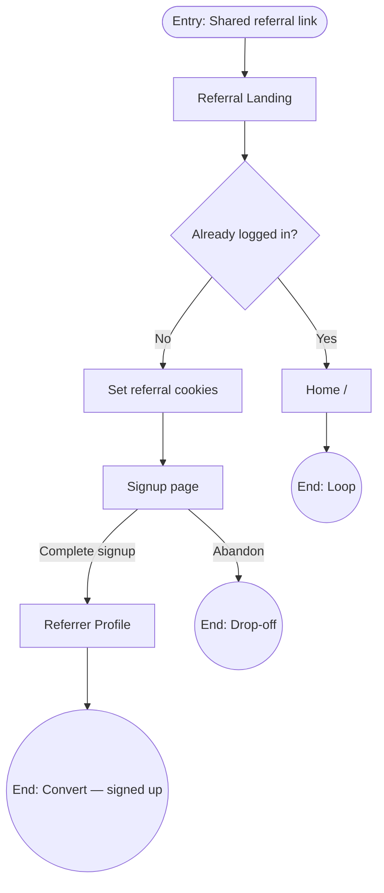

| Node | Trigger/Action | Next Node(s) | Notes |
|------|----------------|--------------|-------|
| ReferralLandingPage | `referrar/[username]/page.tsx` L14–24 | Signup or Home | Sets `setReferralCode` + `setReferralRedirectProfile` |
| Post-signup | `auth-context.tsx` L538–546 | `/profile/{referrer}` | Overrides default `/` redirect — no `?redirect=` needed |

---

## 16. Guest Conversion Nudges

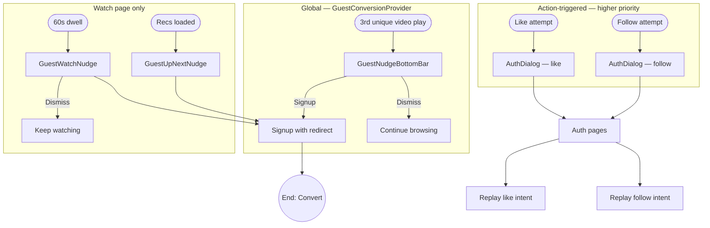

| Node | Trigger/Action | Next Node(s) | Notes |
|------|----------------|--------------|-------|
| 3rd-track bar | `guest-conversion-provider.tsx` L54; `session.ts` play count | Signup | Shown when `shouldShowThirdTrackBottomBar(pathname)` |
| Watch 60s nudge | `guest-watch-nudge.tsx` L17 `WATCH_DWELL_MS = 60_000` | Signup | Passive; priority below like/follow (`types.ts` L10–16) |
| Up Next nudge | `guest-up-next-nudge.tsx` in watch sidebar | Signup | Trigger `rec_ready` when suggestions load |
| Intent replay | `replay-intents.ts` | Like + follow only | Playlist save excluded |

---

## 17. Support Reports (`/support/reports`)

```mermaid
flowchart TD
    EP1([Entry: Navbar My reports]) --> REP[Reports List]
    EP2([Entry: Report detail URL]) --> DET[Report Detail]

    REP --> AUTH{user?}
    DET --> AUTH
    AUTH -->|No| LOGIN[Login with redirect]
    AUTH -->|Yes| LOAD[Fetch flags API]

    LOAD --> A1{Action}
    A1 -->|Click report row| DET
    A1 -->|Back to support| SUP[/support]
    A1 -->|Click flagged content| TARGET[Watch or Profile]

    DET --> D1{Action}
    D1 -->|Copy reference ID| T_COPY((End: Done))
    D1 -->|View reported content| TARGET
    D1 -->|Back to list| REP
```

| Node | Trigger/Action | Next Node(s) | Notes |
|------|----------------|--------------|-------|
| Auth redirect | `support/reports/page.tsx` L51–52 | `buildLoginUrl("/support/reports")` | Detail page L35–36 same pattern with encoded path |
| Flag target link | `getFlagTargetHref(flag)` | Watch or profile | Depends on report type |

---

## 18. Global video context (not active mini-player)

`VideoProvider` is mounted in `app/layout.tsx`, and `VideoCard` calls `playVideo()` on open — but **`GlobalPersistentPlayer` is not rendered anywhere**, so mini/expanded floating UI never appears. Documented for audit completeness; do not treat as a live user surface until the component is wired into a layout.

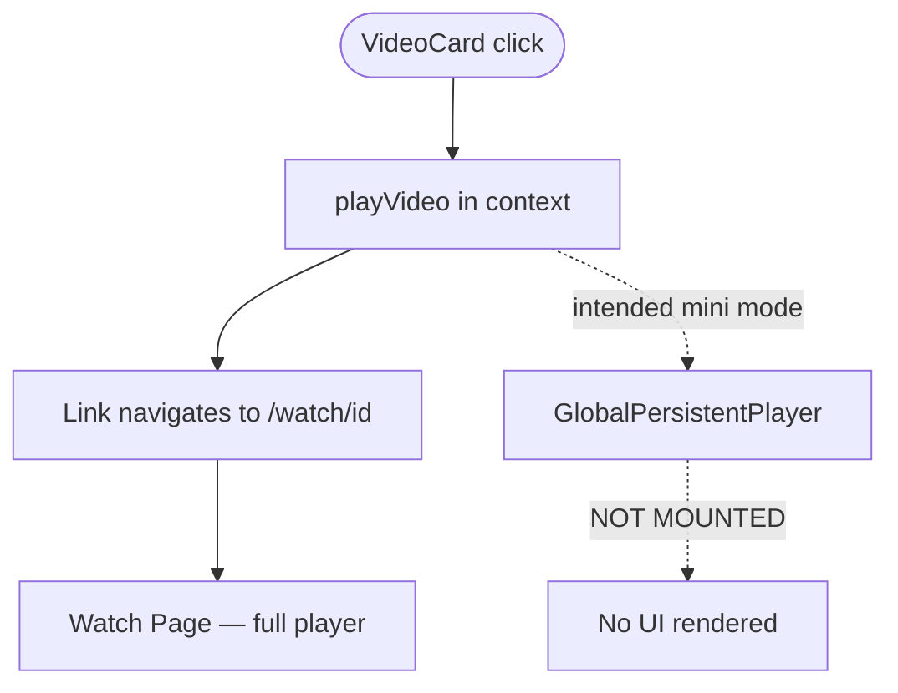
